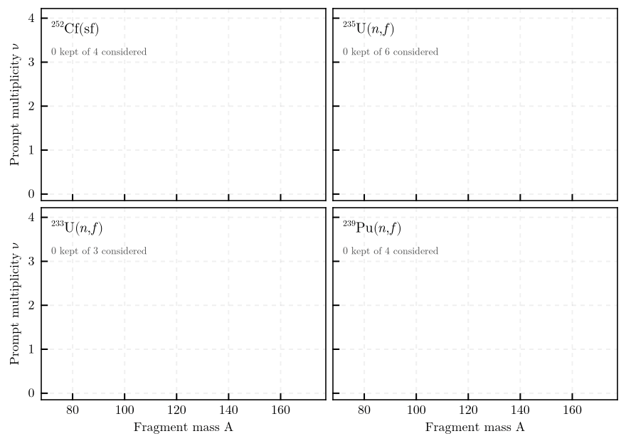

```@meta
CurrentModule = ExforFissionData
```

# ExforFissionData

Retrieval of experimental fission observables from the IAEA EXFOR archive, as tabulated data
files with a record of everything the query considered.

A query names a fissioning system — target charge, target mass and entrance channel — and the
observable wanted as an abscissa and an ordinate. The package finds the datasets that answer it,
reduces each to one row per abscissa value, and writes them beside a run record naming every
dataset it kept or excluded, with the reason.



Prompt neutron multiplicity against fragment mass, one panel per fissioning system. Each frame
advances through the datasets the archive offers for that query in the order the pipeline
processes them; a dataset enters the axes only where its reaction code answers the query. Thirty
datasets kept of 824 considered, with the run record naming the remainder and the reason each was
left out.

```julia
using ExforFissionData

configuration = load_configuration("config/Cf252_sf_nu_vs_A.toml")
result = retrieve(configuration)

length(result.accepted), length(result.rejected)
```

or from a shell,

```
julia scripts/retrieve.jl config/Cf252_sf_nu_vs_A.toml
```

## Observables

A quantity has one name in a configuration and one symbol in a path, a file name and a column
header.

| Abscissa | Symbol | Meaning |
| :--- | :--- | :--- |
| `mass`, `product_mass` | `A`, `A_p` | pre- and post-neutron fragment mass |
| `charge` | `Z` | fragment charge |
| `neutron_energy` | `E` | secondary neutron energy |
| `total_kinetic_energy` | `TKE` | total kinetic energy |

| Ordinate | Symbol | Meaning |
| :--- | :--- | :--- |
| `yield` | `Y` | fission yield |
| `multiplicity`, `multiplicity_per_fission` | `nu`, `nu_bar` | prompt neutron multiplicity, per fragment and per fragment pair |
| `fragment_kinetic_energy`, `product_kinetic_energy` | `E_K`, `E_K_p` | pre- and post-neutron fragment kinetic energy |
| `total_kinetic_energy`, `post_neutron_total_kinetic_energy` | `TKE`, `TKE_p` | pre- and post-neutron total kinetic energy |
| `neutron_kinetic_energy` | `eps` | centre-of-mass neutron energy |
| `spectrum`, `spectrum_maxwellian_ratio` | — | prompt fission neutron spectrum, absolute and as a ratio to a Maxwellian |

An abscissa is a list, because it is a joint index: `["mass"]`, or
`["mass", "total_kinetic_energy"]` for ν(A, TKE). The retrieval is written to
`data/<system>/<observable>/`, where the system is an element symbol, a mass number and an
entrance channel — `Cf252_sf`, `U235_nth`, `U235_nres` — and the observable is the ordinate, `vs`,
then the abscissa symbols: `nu_vs_A_TKE`, `Y_vs_A`, `spectrum_maxwellian_ratio_vs_E`.

Not every combination exists in the archive. ν(TKE), for instance, is reported as a pair quantity,
so `multiplicity_per_fission` against `["total_kinetic_energy"]` returns data where
`multiplicity` returns none.

## What the package does not do

**No normalisation is applied to ordinates.** Normalisation conventions differ between consumers
and cannot be undone once applied, so the unit token of each dataset is recorded instead. A query returning more than one unit token is flagged: such datasets
must not be renormalised together.

**No point is dropped on the basis of its value or uncertainty.** Quality cuts belong with the
project that can justify them. Values in the far-asymmetric mass tails are statistically poor and
are written unchanged, with their uncertainties.

**The uncertainty column is omitted** when no row of a dataset carries one, rather than written
as a column of zeros.

**Fragment and prompt-neutron observables only.** Prompt-γ quantities, the multiplicity
distribution P(ν), and the centre-of-mass spectrum Φ(ε) are outside the observable set; the last
the archive does not carry as a quantity of its own.

**Spectra between two fissioning systems** — the ratio form the archive holds a good deal of — are
a distinct observable and are excluded. A spectrum as a ratio to a Maxwellian is not: that is
`spectrum_maxwellian_ratio`.

**Relative data is retrieved but kept apart.** A prompt fission neutron spectrum is conventionally
measured relative and normalised afterwards, so most of what the archive holds for ²³⁵U(n,f) is in
arbitrary units. Those datasets are written under `relative/` rather than beside the absolute ones,
because a relative dataset cannot be put on a common scale with anything — not even
another relative dataset. Each must be normalised on its own, and none may be averaged with
absolute data. A reader that takes a whole directory therefore cannot pick one up by accident, and
the run record marks every accepted dataset `relative = true` or `false`.

Arbitrary units remain fatal for every other ordinate, where a relative value is not an
interpretable quantity.

## Conventions applied

Energies are restated in MeV — both an energy abscissa and an ordinate that is itself an energy.
These are exact conversions of a value with the factor recorded in the run record, which is a
different thing from a normalisation.

Duplicate abscissa values are resolved rather than averaged blindly, because three different
things cause them:

| Cause | Treatment |
| :--- | :--- |
| several incident energies | selected by the configured window, as a row filter |
| isomeric states | the archive's own total where it gives one, otherwise the resolved states summed with uncertainties in quadrature |
| genuine repeats | inverse-variance weighted mean, uncertainty ``1/\sqrt{\sum 1/\sigma^2}`` |

## Selection

Datasets are chosen by substring tests over the EXFOR reaction code, for instance
`92-U-233(N,F)ELEM/MASS,CUM,FY`. The archive applies its own vocabulary inconsistently, so the
tables in `reaction_codes.jl` are empirical: they encode observed failures of the upstream
labelling rather than a formal grammar.

Three checks are worth naming because they are easy to get wrong:

- the `y:Value` column marks **upper limits** with a `Max(` prefix — those rows are bounds, not
  measurements;
- it also marks **arbitrary units** as `ARB-UNITS`, which carry no scale;
- the incident-energy window applies **per row**, not to the dataset as a whole, since one
  product is frequently reported at several energies.

Reaction-code qualifiers that bear on a value's scale — `MSC`, `REL`, `CHN`, `DERIV`, `FCT` — and
those naming the inducing neutron spectrum are recorded per dataset rather than used to reject
it.

## Retrieval

Requests run under bounded concurrency with a per-request timeout and exponential backoff, and
every response is cached on disk. An EXFOR entry is immutable once published, so a dataset is
fetched at most once and a re-run costs nothing. Datasets are processed and written in identifier
order, so a re-run over an unchanged archive reproduces its output exactly.

## API

```@index
```

```@autodocs
Modules = [ExforFissionData]
```
